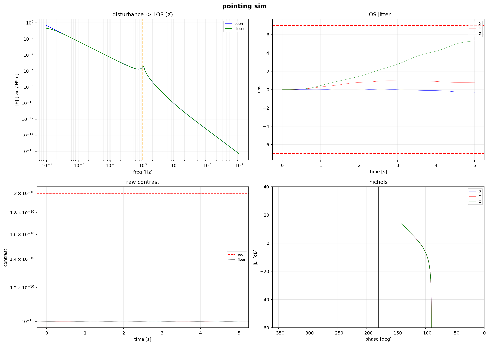
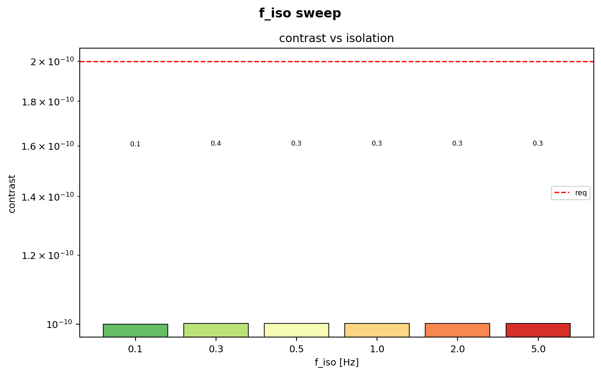
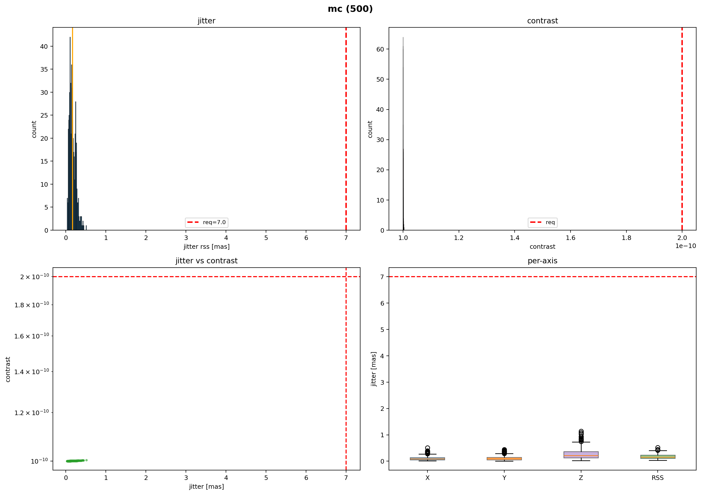

1\. Fine-pointing pipeline

A Basilisk simulation that propagates reaction-wheel disturbances through a coupled bus/payload plant, an H-infinity controller, a multiplicative extended Kalman filter, and a coronagraph contrast model.

0.28 mas RMS LOS jitter, 1.00e-10 raw contrast, 100% pass rate across 500 Monte Carlo trials.

2\. Architecture

RWA (Masterson) to TwoBodyPlant (14-state RK4) to MEKF (6-state Joseph form).
MEKF nav feeds HinfCtrl (per-axis), torque feeds back to plant.
Contrast model runs on payload jitter: beamwalk to contrast degradation.

Five Basilisk modules at three rates: 1 kHz dynamics, 100 Hz FSW, 10 Hz FGS.

3\. Key numbers

- LOS jitter (RSS): 0.28 mas
- Estimation error (RSS): 0.51 mas
- Raw contrast: 1.00e-10
- Beamwalk: 159 pm
- Gain margin: infinite (all axes)
- Phase margin: 70.5 deg (all axes)
- Monte Carlo: 500 trials, 100% jitter pass, 100% contrast pass

4\. Physics

- Disturbance: Masterson (1999, 2002) tonal harmonics at physically motivated ratios (bearing cage, static/dynamic imbalance, ball pass, motor ripple). Omega^2 amplitude scaling. Filtered broadband.
- Plant: coupled two-body rigid dynamics with 3-axis spring-damper isolation mount. RK4 at 1 kHz with quaternion renormalisation at each substage.
- Estimation: multiplicative EKF, Markley & Crassidis (2014) chapter 6. Joseph-form covariance. Farrenkopf gyro process noise (ARW + bias instability).
- Control: per-axis H-infinity state feedback via generalised ARE gamma-bisection. Luenberger observer with pole placement ~10x controller bandwidth.
- Contrast: beamwalk-to-contrast, Nemati & Stahl (2020) contrast budgeting. Second-order degradation from coronagraph mask displacement.

5\. Results



```
  hinf  fi=1.0 Hz  5.0 s
  X: gmin=1.000  gused=2.000
  Y: gmin=1.000  gused=2.000
  Z: gmin=1.000  gused=2.000
  K_X = [3.34, 666, 0.28, 56.3]
  K_Y = [3.34, 666, 0.28, 56.3]
  K_Z = [3.30, 419, 0.33, 41.9]
  jitter X/Y/Z: 4.465e-07 / 1.261e-06 / 8.063e-06 mrad  rss: 1.338e-06
  est err rss: 2.450e-06 mrad  beamwalk: 159 pm  contrast: 1.00e-10
  margins X: gm=inf, pm=70.5 deg
  margins Y: gm=inf, pm=70.5 deg
  margins Z: gm=inf, pm=70.5 deg

  budget
  contrast:      1.00e-10  /  req < 2e-10  (mech 1.05e-13, floor 1.00e-10)
  beamwalk:      159 pm  /  req < 5500 pm
  jitter rss:    0.28 mas  /  req < 7.0 mas  (X 0.09, Y 0.26, Z 1.66)
  est err rss:   0.51 mas  /  req < 3.0 mas
  struct:        ok (0.88 x omega @ 17.6 Hz, 17.3% from 15.0 Hz)
```



```
  isolation frequency sweep
  f_iso=0.1: jitter=0.09 mas  C=1.00e-10
  f_iso=0.3: jitter=0.35 mas  C=1.00e-10
  f_iso=0.5: jitter=0.31 mas  C=1.00e-10
  f_iso=1.0: jitter=0.30 mas  C=1.00e-10
  f_iso=2.0: jitter=0.30 mas  C=1.00e-10
  f_iso=5.0: jitter=0.29 mas  C=1.00e-10
```



```
  monte carlo: 500 runs
  500 valid  jitter: 100.0%  contrast: 100.0%
```

6\. Files

- src/modules.py: five Basilisk SysModel subclasses (RWA, plant, MEKF, controller, contrast)
- src/params.py: all physical parameters, constants, conversions
- src/run_sim.py: controller synthesis, single run, frequency sweep, Monte Carlo, V&V matrix
- src/_run_mc.py: Monte Carlo harness
- src/LIBRARY.md: physics sources and references

7\. Contact

Faraz Nasir

All parameters and data in this repository are drawn from published open-access technical papers and textbooks. A local LLM was used for code debugging and formatting.
